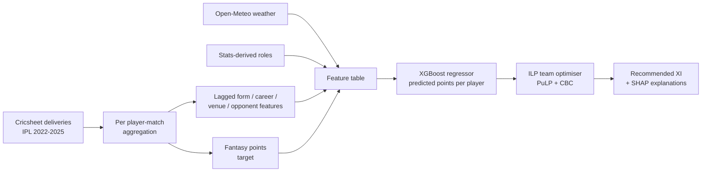
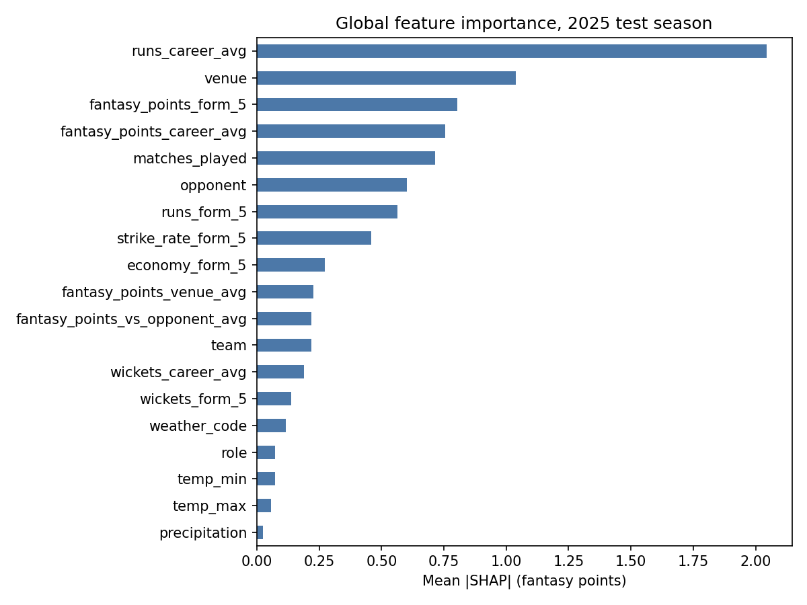

# Next-Gen Team Builder with Predictive AI — Project Report

**Task:** Recommend an 11-player IPL fantasy team for an upcoming match by predicting each player's fantasy points, with explanations for every pick.
**Training data:** Cricsheet ball-by-ball data, Domestic → Men's → IPL, seasons 2022–2025 only. No 2026 data is used anywhere.

---

## 1. Summary

The solution has two stages:

1. **Player points model.** A gradient-boosted tree regressor (XGBoost) predicts each player's fantasy points for a match, using rolling form, career averages, venue and opponent history, a stats-derived player role, and match-day weather.
2. **Team optimiser.** An integer linear program (ILP) picks the 11 players with the highest total predicted points, subject to the hackathon's team-composition rules (1–8 per role, at least one player from each side).

Each recommended player comes with a SHAP breakdown of the features that raised or lowered their prediction.

**Headline results.** Evaluated on the full 2025 season (1,712 player-match rows; 73 matches for the team-level numbers), with the model trained on 2022–2024:

| | Player-level MAE | XI points as % of best possible XI |
|---|---|---|
| Predict the training mean for everyone | 24.66 | 60.6 % |
| Career average | 24.59 | **65.6 %** |
| LP heuristic (mean of 4 averages) | 25.26 | 65.2 % |
| **XGBoost (all features)** | **24.38** | 65.1 % |

Per-player fantasy points in T20 are just very noisy. XGBoost is better than any baseline at predicting an individual player's points, but it does not actually pick better teams than a plain career average — all three models land within half a point of each other on the share of the Dream Team they capture. Section 7.3 gets into why, and Section 10 lists what's most likely to help.

---

## 2. Problem and constraints

| Requirement (from brief) | How it is handled |
|---|---|
| Input: two team names (Cricsheet spelling) and a match date | Candidate pool = both squads. Features are taken as each player's latest values strictly before the match date. |
| 11 players, 1–8 each of batter / bowler / all-rounder / wicketkeeper, at least 1 from each team | Hard constraints in the ILP (Section 6.2) |
| Train only on IPL 2022–2025, never on 2026 | Every feature is computed from 2022–2025 deliveries. Evaluation holds out 2025 in the same way 2026 will be held out. |
| Toss not known, no playing XI or batting order | No feature uses toss, XI or batting position. Only pre-match history and context are used. |
| Features must be available for future matches | All features are lagged (prior matches only). See Section 4.3 for the one exception (weather). |
| Recommendation in under 10 s | ILP solve takes 0.07 s on average and 0.09 s at worst over the 73 evaluated 2025 matches; model inference takes milliseconds |

---

## 3. Data

### 3.1 Source and scope

- **Cricsheet IPL ball-by-ball**, 2022–2025: 291 matches, 18 venues, 10 franchises.
- Deliveries are aggregated into one row per player per match. After cleaning this gives **6,713 player-match rows** and 358 players (about 1,620–1,720 rows per season).

### 3.2 Per-match aggregation

For each player in each match, the delivery data is rolled up into:

- **Batting:** runs, balls faced (wides excluded), fours, sixes, whether dismissed, how dismissed, strike rate
- **Bowling:** legal balls, runs conceded (bat runs, wides and no-balls), wickets (run-outs, retired and obstructing dismissals excluded), overs, economy, maidens
- **Fielding:** catches, stumpings, run-outs (credited from the `fielder` column)

### 3.3 Cleaning

The raw `fielder` column contains substitute fielders (`(sub)Anukul Roy`) and combined entries (`Tilak Varma/Ishan Kishan`). These create fake "players" with a few catches each. The cleaned dataset drops them, which takes the table from 6,813 to 6,713 rows.

**Remaining known issue.** 167 rows belong to players who only fielded in that match (took a catch without batting or bowling), and these rows have no `team`. For evaluation we fill in the team from that player's most common team in the same season, and take the opponent to be the other side in that match. The 31 rows that still can't be resolved are dropped, leaving **6,682 rows** for evaluation (4,970 train, 1,712 test).

### 3.4 External data (fetched programmatically)

| Source | What | Coverage |
|---|---|---|
| Open-Meteo historical archive API | Daily max/min temperature, precipitation and weather code at each venue's coordinates on match day | 100 % of matches |
| Wikipedia infobox scrape | Playing role, batting style, bowling style, nationality | About 35 % of players. Surname-only Cricsheet names (e.g. "Kohli") often don't match a Wikipedia page. |

Because the Wikipedia roles cover only about a third of players and use around 30 different spellings (`Battingall-rounder`, `Wicket-keeperbatsman`, `Bowler[2][3]`, …), we don't use them directly as the role feature (see Section 4.2).

---

## 4. Features

### 4.1 Target: fantasy points

The target is the fantasy points a player scores in a match. We reconstructed the scoring rules below from the data, and they reproduce the target exactly for **all 6,713 rows**:

| Event | Points |
|---|---|
| Run | +1 |
| Boundary bonus (four / six) | +1 / +2 |
| 30 / 50 / 100 runs (highest milestone only) | +4 / +8 / +16 |
| Dismissed for a duck | −2 |
| Wicket (excluding run-out) | +25 |
| 3 or 4 wickets / 5+ wickets bonus | +4 / +8 |
| Maiden over | +12 |
| Catch | +8 |
| Stumping / run-out | +12 |

Across the dataset the target averages 34.6 points, with a standard deviation of 31.4, a median of 25 and a maximum of 222. It is heavily right-skewed: a few big innings or wicket hauls dominate.

### 4.2 Feature set

Every history feature is computed **only from matches before the current one** (lagged by one match). We checked this independently: recomputing each feature with a lagged rolling window matches the stored values for more than 99.8 % of rows. The small percentage comes from the days with two matches.

| Group | Features | Notes |
|---|---|---|
| Recent form (last 5 matches) | `runs_form_5`, `wickets_form_5`, `fantasy_points_form_5`, `strike_rate_form_5`, `economy_form_5` | Missing for a player's first IPL match (5.5 % of rows) |
| Career | `runs_career_avg`, `wickets_career_avg`, `fantasy_points_career_avg` | Expanding mean over all earlier matches |
| Experience | `matches_played` | Count of the player's earlier IPL matches. Computed in `evaluation.py`, not stored in the CSV. |
| Venue history | `fantasy_points_venue_avg` | Player's average at this venue. Missing for 40 % of rows (first visit). |
| Opponent history | `fantasy_points_vs_opponent_avg` | Player's average against this opponent. Missing for 36 % of rows. |
| Match context | `venue`, `team`, `opponent` | Categorical, handled natively by XGBoost |
| Weather | `temp_max`, `temp_min`, `precipitation`, `weather_code` | Open-Meteo, match day at venue |
| **Player role (stats-derived)** | `role` belongs to {batter, bowler, allrounder, wicketkeeper} | See below. Computed in `evaluation.py`; the CSV stores only the scraped `player_role` text. |

**Stats-derived player roles.** The role is needed twice: as a model feature and for the team-composition constraints. We derive it from how each player is actually used in the IPL, not from scraped text:

- **Wicketkeeper:** at least one stumping, or the scraped role mentions keeper
- **All-rounder:** averages ≥ 0.8 overs bowled **and** ≥ 6 balls faced per match
- **Bowler:** meets the overs threshold only
- **Batter:** everyone else

We chose the thresholds by comparing against the players whose Wikipedia role is known. Mapping the scraped text instead leaves half of all players with no role (`UNKNOWN`).

**The role is recomputed for every row from that player's earlier matches only**, so it never uses the match being predicted, and a player can be reclassified as their career develops. By each player's last 2025 appearance the split is 137 batters, 157 bowlers, 28 all-rounders and 36 wicketkeepers. A player's first-ever match has no history, so they start as a batter unless the scraped text says wicketkeeper.

The main disagreement with Wikipedia is players it calls "batting all-rounders" who barely bowl in the IPL. Tilak Varma and Shivam Dube, for example, bowl about 0.1 overs per match, and we classify them as batters. For fantasy scoring, how a player is used in the IPL is what counts.

### 4.3 Feature availability for future matches

Every history feature can be computed on the day before a match from past data alone. **Weather is the exception.** In training it is the *observed* weather on match day. For a genuinely upcoming match it would come from a forecast. This is a small train/serve mismatch, and in practice weather contributes very little (Section 7).

---

## 5. Model architecture



### 5.1 Points model: XGBoost regressor

| Setting | Value |
|---|---|
| Objective | Squared error (reported metric: MAE) |
| Trees | Up to 2,000, with early stopping (50 rounds) on the validation season. **42 trees selected** for the 2025 test run. |
| Depth / learning rate | 4 / 0.03 |
| Row / column subsampling | 0.8 / 0.8 |
| `min_child_weight`, `reg_lambda` | 5, 1.0 |
| Categoricals | Native (`enable_categorical=True`, `tree_method="hist"`) |
| Missing values | Native. Tree splits learn a default direction for missing values, e.g. a player's first appearance at a venue. |
| Seed | 42 (deterministic) |

**Why gradient-boosted trees.** The feature table is small (about 5,000 training rows), mixes numeric and categorical columns, and has many structurally missing values. Trees handle all of these natively, they are fast, and exact SHAP values are cheap to compute for them.

### 5.2 Team optimiser: integer linear program

For a candidate pool of players $P$ with predicted points $\hat{y}_i$, team $t_i$ and role $r_i$, choose binary variables $x_i$ to

$$\max (\sum_{i \in P} \hat{y}_i x_i) \quad \text{s.t.} \quad \sum_i x_i = 11,\quad \sum_{i: t_i = T} x_i \ge 1 \;\; \forall T,\quad 1 \le \sum_{i: r_i = R} x_i \le 8 \;\; \forall R.$$

The problem is solved with PuLP and the CBC solver. With about 25 candidates it solves in about 70 ms, far within the 10-second limit. Because the solution is an exact optimum of the objective, all the quality of the recommendation comes from the point predictions.

---

## 6. Evaluation protocol

Everything in this section is implemented in **`src/scripts/evaluation.py`**, which reproduces both result tables and writes one row per match per model to `src/model_artifacts/evaluation_2025.csv`:

```
uv run --no-project --with xgboost --with pulp --with pandas --with numpy \
  python src/scripts/evaluation.py --test-season 2025
```

- **Split by season, never shuffled:** train on 2022–2023, validate on 2024 (early stopping only), then **refit on 2022–2024** with the selected number of trees and **test on 2025**. This is the same setup as the official evaluation, which trains on ≤ 2025 and tests on 2026.
- **Player-level metrics:** MAE, RMSE, R², and the Spearman rank correlation between predicted and actual points *within each match*. Ranking within a match is what drives team selection.
- **Team-level metrics:** for each 2025 match, the ILP picks an XI from the players who appeared in that match, using each model's predictions. The **Dream Team** is the ILP solution using *actual* points (the best possible XI under the same constraints). We report:
  - the actual points scored by the predicted XI
  - those points as a percentage of the Dream Team's points
  - how many players the predicted XI shares with the Dream Team
  - the MAE between the predicted and actual XI totals

**Caveats.**
- The evaluation pool contains only players who actually took part (batted, bowled or fielded). At real prediction time the pool is the full squad of about 15 per side, so real-world performance will be somewhat lower.
- One 2025 match (`202558`, PBKS vs DC) was abandoned after a few overs and has only 8 players in the data. No XI can be picked from it, so the team-level tables cover **73 of the 74 matches**. Player-level metrics still use all 1,712 rows.

**Baselines:**
- **Mean:** the same prediction for everyone, so the ILP's choice is effectively arbitrary
- **Career average:** the player's career average
- **LP heuristic:** the average of form, career, venue and opponent averages, as in the team's first prototype `LPBaselineModel.py`

---

## 7. Results

### 7.1 Player-level (2025 test season, 1,712 rows)

| Model | MAE ↓ | RMSE ↓ | R² ↑ | Within-match Spearman ↑ |
|---|---|---|---|---|
| Mean baseline | 24.66 | 30.99 | 0.000 | — (constant) |
| Career average | 24.59 | 31.12 | −0.008 | **0.149** |
| LP heuristic (mean of 4 averages) | 25.26 | 32.36 | −0.090 | 0.129 |
| **XGBoost, all features** | **24.38** | **30.60** | **0.025** | 0.116 |

### 7.2 Team-level (73 matches in 2025; Dream Team averages 649 points)

| Model | Actual points of XI | % of Dream Team | Overlap with Dream XI | Team total MAE |
|---|---|---|---|---|
| Mean baseline (arbitrary XI) | 393.2 | 60.6 % | 5.6 / 11 | **79.9** |
| **Career average** | **426.3** | **65.6 %** | 5.9 | 101.1 |
| LP heuristic | 423.5 | 65.2 % | 5.9 | 105.2 |
| XGBoost, all features | 422.4 | 65.1 % | 5.8 | 85.5 |

### 7.3 What the results say

1. **Every approach captures about two-thirds of the best possible score, and the models add about 5 percentage points over an arbitrary XI.** The best model reaches 65.6 % against 60.6 %. Per-match results vary widely: XGBoost ranges from 36 % to 90 % across the season, and beats the arbitrary XI in only 60 % of matches (career average: 66 %).
2. **XGBoost predicts individual players best but does not select better teams.** It has the lowest player-level MAE (24.38) and its predicted XI totals track reality far better than the averaging baselines (team total MAE 85.5 vs 101–105), yet it captures no more of the Dream Team than a plain career average. Selection depends only on *ranking players within a match*, and there the career average is still the best of the four (Spearman 0.149 vs 0.116).
3. **The mean baseline has the lowest team-total MAE, and that metric is misleading.** Predicting the same value for everyone gives an XI total near the season average, which happens to be close on average while the XI itself is arbitrary. Read team total MAE only alongside % of Dream Team.
4. **Weather contributes almost nothing.** The four weather features together account for 0.27 points of mean |SHAP|, below `matches_played` on its own (Section 8.1).
5. **Early stopping picks only 42 trees at learning rate 0.03.** The model barely moves away from the mean before validation error stops improving. That is a symptom of a low signal-to-noise target, not of a model that is too small.

**Changes from the 21 September run.** Roles are now derived from each player's earlier matches only; previously they were derived once from the whole dataset, which let the test season leak into a feature. XGBoost's share of the Dream Team drops from 67.1 % to 65.1 %, which puts it behind the career average. The earlier ablations (scraped roles, no-weather) are not in this table because the current script evaluates one XGBoost configuration; re-adding them is a matter of adding entries to its `MODELS` dict.

---

## 8. Explainability

### 8.1 Global feature importance (SHAP, 2025 test set)



| Rank | Feature | Mean \|SHAP\| (points) |
|---|---|---|
| 1 | `runs_career_avg` | 2.04 |
| 2 | `venue` | 1.04 |
| 3 | `fantasy_points_form_5` | 0.80 |
| 4 | `fantasy_points_career_avg` | 0.75 |
| 5 | `matches_played` | 0.72 |
| 6 | `opponent` | 0.60 |
| 7 | `runs_form_5` | 0.56 |
| 8 | `strike_rate_form_5` | 0.46 |
| … | `role` | 0.07 |
| … | weather (`weather_code`, `temp_min`, `temp_max`, `precipitation`) | 0.12, 0.07, 0.06, 0.02 |

In plain terms: the model mostly asks **"how many runs does this player usually get?"** It then adjusts for the venue, recent form, experience and the opponent. `role` now barely matters on its own (0.07 points, down from 0.49): with roles derived per match from prior form, the form and career features already carry most of what the role used to stand for. It still matters for the optimiser, where it drives the composition constraints.

### 8.2 Per-player justification (Product UI output)

For every recommended player, the UI shows the predicted points and the three features that moved the prediction most, relative to the average player (base value 34.7 points). Example: **2025 final, PBKS vs RCB, Narendra Modi Stadium, 3 June 2025.**

| Player | Team | Role | Predicted | Actual | Top drivers (SHAP, points) |
|---|---|---|---|---|---|
| Kohli | RCB | batter | 45.3 | 50 | runs_career_avg (+6.4), runs_form_5 (+1.0), fantasy_points_venue_avg (+1.0) |
| Rajat Patidar | RCB | batter | 44.9 | 31 | runs_career_avg (+6.9), fantasy_points_career_avg (+1.1), matches_played (+0.7) |
| Priyansh Arya | PBKS | batter | 43.5 | 36 | runs_career_avg (+5.7), fantasy_points_venue_avg (+1.1), fantasy_points_career_avg (+1.0) |
| Phil Salt | RCB | wicketkeeper | 42.6 | 28 | runs_career_avg (+5.0), fantasy_points_career_avg (+1.1), venue (+0.8) |
| Shreyas Iyer | PBKS | batter | 41.7 | 17 | runs_career_avg (+4.5), fantasy_points_career_avg (+1.0), fantasy_points_venue_avg (+0.7) |
| Prabhsimran | PBKS | wicketkeeper | 41.0 | 30 | runs_career_avg (+4.5), fantasy_points_career_avg (+1.1), runs_form_5 (+0.9) |
| Krunal Pandya | RCB | allrounder | 36.4 | 62 | fantasy_points_form_5 (+1.7), runs_career_avg (−1.4), venue (−1.1) |
| Stoinis | PBKS | allrounder | 36.4 | 8 | fantasy_points_career_avg (+1.2), venue (−1.0), matches_played (+0.6) |
| Azmatullah | PBKS | bowler | 35.8 | 34 | fantasy_points_form_5 (+1.8), runs_career_avg (−1.7), fantasy_points_career_avg (−0.8) |
| Josh Inglis | PBKS | wicketkeeper | 35.7 | 52 | fantasy_points_career_avg (+1.2), fantasy_points_form_5 (+0.9), strike_rate_form_5 (−0.9) |
| Chahal | PBKS | bowler | 34.8 | 25 | runs_career_avg (−2.3), fantasy_points_career_avg (+0.9), fantasy_points_form_5 (+0.8) |
| **Total** | | | **438.2** | **373** | Dream Team for this match: 629 |

This match shows the main weakness. The model spreads its predictions across a narrow band (35–45 points), so it can't anticipate the big individual performances that make up most of the Dream Team's points. Krunal Pandya top-scored with 62 on a prediction of 36.4, and Stoinis returned 8 on a nearly identical 36.4.

---

## 9. Interfaces

| Interface | Brief requirement | Current status |
|---|---|---|
| **Product UI** (Gradio, `src/frontend/main.py`) | Enter two teams and a date, get the recommended XI with a justification for each player, in under 10 s | Gradio page exists, but `inference.py` is still a placeholder. The pieces needed (model, ILP, SHAP) are all done. The model scores in milliseconds and the ILP solves in 0.07–0.09 s, so the 10-second limit is easily met. |
| **Model UI** | Choose train/test periods, retrain, save models to `src/model_artifacts/`, save processed data to `src/data/processed/`, and export a CSV with Match Date, Team 1, Team 2, Predicted XI, Dream Team XI, Predicted Points, Actual Points, MAE | **Not built yet**, but the logic behind it is: `src/scripts/evaluation.py --test-season` already takes the test period and writes exactly those columns to `src/model_artifacts/evaluation_<season>.csv`. The UI has to wrap it and save the fitted model. |

---

## 10. Limitations and next steps

The following are ordered by expected impact on the 70 % "model quality" criterion. The headline problem is now sharper than in the previous run: **XGBoost does not yet beat a career average at choosing an XI**, so items 1 and 2 are the ones that matter.

0. **Optimise for within-match ranking, not absolute error.** The optimiser only cares about the order of players inside one match, but the model is trained on squared error across the whole season, where most of the variance is between players rather than within a match. Worth trying: a ranking objective (`rank:pairwise`) with the match as the group, or predicting points relative to the match average.
1. **Model the target's distribution, not just its mean.** Points are zero-inflated and right-skewed. Promising options:
   - a Tweedie or Poisson objective
   - predicting batting, bowling and fielding points separately and adding them
   - optimising the XI for upside (for example a high quantile) rather than the expected value
2. **Expected involvement features.** The biggest source of variance is whether and how much a player bats or bowls. Useful pre-toss proxies:
   - typical batting position in recent matches
   - share of the team's overs bowled recently
   - how often the player was in the XI in recent matches
3. **Player identity resolution.** Cricsheet surnames produce duplicates (`Phil Salt` / `Philip Salt`, `Saha` / `W Saha`) and block external joins. A single canonical player ID would fix both.
4. **Pitch and venue features.** Use venue-level run rates and pace-vs-spin wicket shares, computed from past deliveries. The brief states pitch type is known before the match.
5. **Use weather forecasts at prediction time** so the features match between training and serving (Section 4.3).
6. **Evaluate with full squads (about 15 per side)** rather than only players who took part, to match the real use case.

---

## 11. Reproducibility and submission checklist

| Item | Status |
|---|---|
| Deterministic training (fixed seed, fixed season split) | Done |
| Training restricted to IPL 2022–2025 and no 2026 data | Done |
| External data fetched programmatically (`src/scripts/external_data_integration.ipynb`) | Done |
| Model training script (`src/scripts/train_xgboost_model.py`) | **Currently broken.** Its `DATA_PATH` points at `src/data/aggregate_player_match_features_with_external_data.csv`, whose columns don't match, and it lists features that aren't in the data (`humidity`, `wind_speed`, `pitch_type`). `evaluation.py` fits the same model correctly and is the reference for the feature list. |
| Evaluation script that reproduces Section 7 | Done: `src/scripts/evaluation.py` |
| `requirements.txt` | To be added. Dependencies are currently in `pyproject.toml` and `uv.lock`, which now cover `xgboost` and `shap`. `scikit-learn` is still missing, and `train_xgboost_model.py` imports it; `evaluation.py` deliberately does not. |
| `src/model_artifacts/`, `src/data/processed/` | To be created by the Model UI |
| Product UI and Model UI | See Section 9 |
| Video demo | To do |
